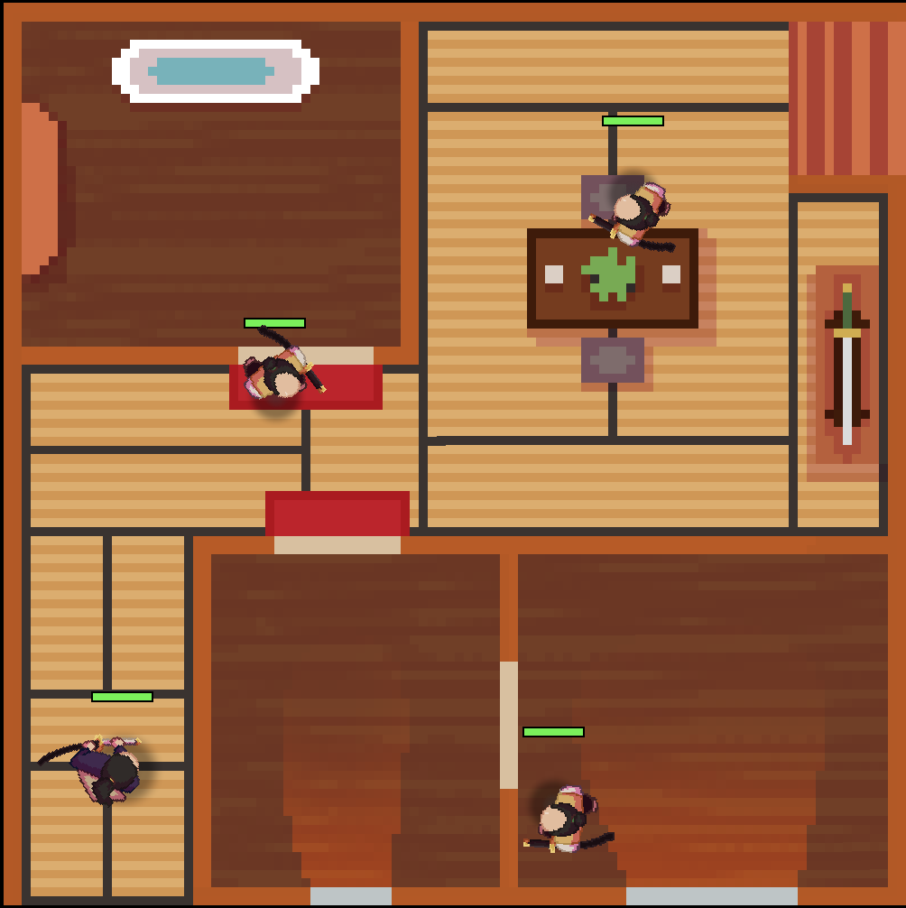

# Ronin's Revenge

>Projet réalisé par : Wassim HAMRIT, Ibrahim OZEL et Dalil NAAMNA dans le cadre de projet IA.

Ronin's Revenge est un jeu vidéo réalisé intégralement en C++. Vous êtes un des derniers samouraïs qui revient au dojo plusieurs années après avoir été rejeté du cercle disciplinaire des plus isolés et techniques des samouraïs pour prouver votre valeur.
Ce jeu contient 4 niveaux, dont un niveau final où vous allez combattre le maître Shifu-mi.

## Guide d'installation

Ce jeu a été réalisé pour Linux et ne convient pas pour Windows/MacOS. Vous pouvez choisir de cloner le répertoire puis de réaliser la compilation, ou vous pouvez simplement télécharger une version du jeu et d'y jouer directement.

### Compilation 

Premièrement, installez les pré-requis pour compiler le jeu.

Sur Debian / Ubuntu
```bash
sudo apt update
sudo apt install build-essential cmake pkg-config \
                 libsdl2-dev libsdl2-image-dev libsdl2-mixer-dev \
                 libsdl2-ttf-dev libsdl2-gfx-dev \
                 nlohmann-json3-dev
```

Sur Arch Linux
```bash
sudo pacman -Syu base-devel cmake pkgconf \
              sdl2 sdl2_image sdl2_mixer sdl2_ttf sdl2_gfx \
              nlohmann-json
```

Une fois installé, vous pouvez cloner ce répertoire en faisant :
```bash
git clone https://github.com/imgogole/ia-projet.git
cd ia-projet
./build.sh
```

### Jouer directement

Installez une release directement depuis : https://github.com/imgogole/ia-projet/releases
Après cela, décompressez l'archive en faisant :
```bash
unzip <nom-de-l-archive>.zip
cd <nom-de-l-archive>
```

Vous pouvez directement lancer le jeu en faisant :
```bash
./launch.sh
```

## Ronin's Revenge

Ronin's Revenge est un jeu en 2D à la vue du dessus. Votre but est de passer les niveaux du dojo en ayant tué tous les ennemies du niveaux.

### Contrôles

> **⚠️ Attention :** Les touches du clavier mentionnées sont considérées "physiques". Pour un clavier AZERTY, la touche W est Z, A est Q etc...

**Déplacement :** Utilisez **W**, **S** pour vous déplacer verticalement et **A**, **D** pour vous déplacer horizontalement.
**Orientation :** Utilisez la souris pour fixer le regard du personnage vers le curseur. Vous pouvez également appuyer sur **L** pour activer/désactiver le verrouillage vers l'ennemi le plus proche du personnage.
**Attaque :** Utilisez **Clique gauche** pour attaquer devant vous.

### But

Attaquez les ennemies pour leur faire perdre des points de vie et les tuer. Quand tous les ennemis d'un niveau sont morts, vous pouvez vous diriger vers la sortie (escaliers).



